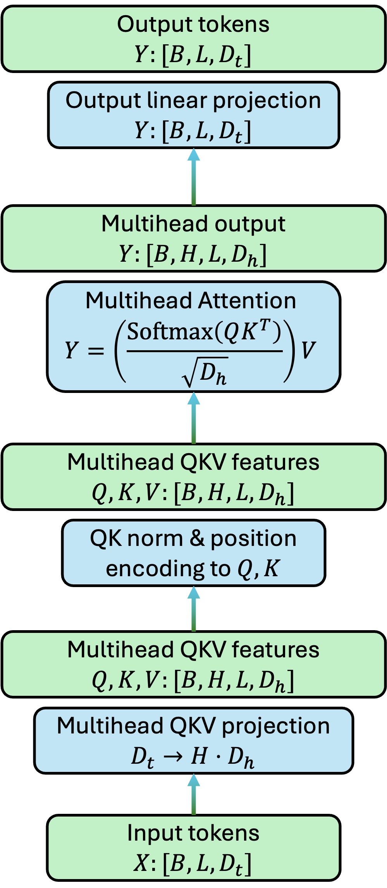

Network Architectures
=====================

.. highlight:: python

Normalization Layers
--------------------

.. todo::

    Add descriptions of QK Norm

Let ``X`` be a tensor of shape ``[B, C, ...]``. All normalization layers do something like the following:

.. code-block:: python
    
    Y = (X - X.mean(dim=...)) / (X.var(dim=..., unbiased=False).sqrt() + eps)   # normalization
    Y = Y * weight + bias   # affine transform

The key difference between different normalization layers are:

1. Across what reduction dimensions are mean are variance computed.
2. Whether running mean and running variance are tracked (if tracked, train and eval behaviors may differ).
3. On what dimensions are affine parameters applied.

A simple comparison of common normalization layers is shown below.

+------------------+-------------------+---------------+----------------------------------------+
| Type             | BatchNorm         | InstanceNorm  | LayerNorm                              |
|                  |                   |               |                                        |
+==================+===================+===============+========================================+
| Reduction        | batch + spatial   | spatial       | last :math:`D` dims                    |
|                  |                   |               | (usually channel + spatial)            |
+------------------+-------------------+---------------+----------------------------------------+
| Tracked mean/var | yes by default    | no by default | not available                          |
+------------------+-------------------+---------------+----------------------------------------+
| Affine           | per-channel       | per-channel   | per-element on the last :math:`D` dims |
+------------------+-------------------+---------------+----------------------------------------+

Batch Normalization
^^^^^^^^^^^^^^^^^^^

``torch.nn.BatchNorm1d``, ``torch.nn.BatchNorm2d`` and ``torch.nn.BatchNorm3d`` computes mean and `biased` variance across all dims except the channel dimension. As a simple example, below are two equivalent forward passes for BatchNorm.

.. code-block:: python
    :caption: BatchNorm equivalent implementation

    import torch
    torch.manual_seed(43)
    B, C, H, W = 2, 3, 2, 2
    x = torch.randn(B, C, H, W)

    # pytorch native BN 
    bn = torch.nn.BatchNorm2d(C, affine=False)
    y1 = bn(x)

    # custom BN
    eps = 1e-5
    mean = x.mean(dim=[0,2,3], keepdim=True)
    var = x.var(dim=[0,2,3], unbiased=False, keepdim=True)
    y2 = (x - mean) / torch.sqrt(var + eps)

    print((y1 - y2).norm())

``BatchNormXd`` also contains tracked statistics (``running_mean`` and ``running_var``), which are updated using a moving average weighted by ``momentum`` during training, and are used instead of batch statistics in eval mode.

.. code-block:: python
    :caption: running_mean and running_var

    import torch
    torch.manual_seed(43)
    B, C, H, W = 2, 3, 2, 2

    # pytorch native BN
    bn = torch.nn.BatchNorm2d(C, affine=False)

    # run through some examples to initialize batch stats
    sequence_to_init_stats = [torch.randn(B, C, H, W) for _ in range(3)]
    for z in sequence_to_init_stats: _ = bn(z)
    print(bn.running_mean, bn.running_var)

    # compare
    x = torch.randn(B, C, H, W)

    # compare in eval mode
    # in eval mode, bn uses running_mean, running_var
    def custom_batch_norm_2d_evalmode(input, running_mean, running_var, eps):
        mean = running_mean[..., None, None]
        var = var[..., None, None]
        out = (input - mean) / torch.sqrt(var + eps)
        return out
    
    bn.eval()
    y1 = bn(x)
    y2 = custom_batch_norm_2d_evalmode(x, bn.running_mean, bn.running_var, 1e-5)
    print((y1 - y2).norm())

    # compare in train mode
    # in train mode, bn uses batch_mean and batch_var
    def custom_batch_norm_2d_trainmode(input, eps):
        mean = input.mean(dim=[0,2,3], keepdim=True)
        var = input.var(dim=[0,2,3], unbiased=False, keepdim=True)
        out = (input - mean) / torch.sqrt(var + eps)
        return out

    bn.train()
    y1 = bn(x)
    y2 = custom_batch_norm_2d_trainmode(x, 1e-5)
    print((y1 - y2).norm())

``BatchNormXd`` allows optimizable affine parameters (``weight: [C]`` and ``bias: [C]``) when you set ``affine=True``. They are applied to the channel dimension of the output through elementwise multiplication and addition.

.. code-block:: python
    :caption: affine parameters

    import torch
    torch.manual_seed(43)
    x = torch.randn(B, C, H, W)

    # pytorch native BN 
    bn = torch.nn.BatchNorm2d(C, affine=True)   # actually affine=True is default
    with torch.no_grad():
        bn.weight[:] = torch.randn_like(bn.weight)
        bn.bias[:] = torch.randn_like(bn.bias)
    y1 = bn(x)

    # custom BN
    eps = 1e-5
    mean = x.mean(dim=[0,2,3], keepdim=True)
    var = x.var(dim=[0,2,3], unbiased=False, keepdim=True)
    y2 = (x - mean) / torch.sqrt(var + eps)
    y2 = y2 * bn.weight[..., None, None] + bn.bias[..., None, None]

    print((y1 - y2).norm())

Instance Normalization
^^^^^^^^^^^^^^^^^^^^^^

Instance normalization is basically the same as batch normalization, except:

1. it does not compute mean and variance across the batch dimension;
2. ``track_running_stats=False`` by default, because instance mean/variance does not reflect dataset statistics so it doesn't make sense to track them.

.. code-block:: python
    :caption: InstanceNorm equivalent implementation
    
    import torch
    torch.manual_seed(43)
    x = torch.randn(2,3,2,2)

    # pytorch native IN
    instnorm = torch.nn.InstanceNorm2d(3, affine=True, track_running_stats=True)   # actually affine=True is default
    y1 = instnorm(x)

    # custom IN
    eps = 1e-5
    mean = x.mean(dim=[2,3], keepdim=True)
    var = x.var(dim=[2,3], unbiased=False, keepdim=True)
    y2 = (x - mean) / torch.sqrt(var + eps)

    print((y1 - y2).norm())

Layer Normalization
^^^^^^^^^^^^^^^^^^^

``LayerNorm`` computes mean and variance over the last :math:`D` dimensions (can be specified by use) of an input, which usually include spatial and channel dimensions. The affine parameters are defined for each individual element for the last :math:`D` dimensions. Moreover, ``LayerNorm`` does not use running mean and variance.

.. code-block:: python
    :caption: LayerNorm equivalent implementation
    
    import torch
    torch.manual_seed(43)
    B, C, H, W = 2, 3, 2, 2
    x = torch.randn(B, C, H, W)

    # pytorch native LN
    # you need to specify the shape of the last D dimensions 
    # LayerNorm will compute mean and variance over these dimensions
    # and also define elementwise affine parameters
    layernorm = torch.nn.LayerNorm([C, H, W])
    with torch.no_grad():
        layernorm.weight[:] = torch.randn_like(layernorm.weight)    # shape [C, H, W]
        layernorm.bias[:] = torch.randn_like(layernorm.bias)        # shape [C, H, W]
    y1 = layernorm(x)

    # custom IN
    eps = 1e-5
    mean = x.mean(dim=[1,2,3], keepdim=True)
    var = x.var(dim=[1,2,3], unbiased=False, keepdim=True)
    y2 = (x - mean) / torch.sqrt(var + eps)
    y2 = y2 * layernorm.weight + layernorm.bias

    print((y1 - y2).norm())

Transformer Architecture
------------------------

Self-Attention
^^^^^^^^^^^^^^

Below is a common self-attention architecture, consisting of a few components:

1. Input linear projection to QKV features
2. QK norm and positional encoding
3. Multihead self-attention
4. Output linear projection

Here :math:`B` denotes batch size, :math:`L` denotes sequence length (number of tokens) and :math:`D_t` denotes token dimensions. Tokens are usually projected to low-dimensional (:math:`D_h`-dimensional) multihead (:math:`H` heads) QKV features of shape :math:`[B, H, L, D_h]`.

.. note::

    1. A common practice is to chose :math:`D_t` divisible by :math:`H` and then set :math:`D_h=D_t/H`.
    2. In scaling the softmax scores, the head dimension :math:`D_h` is used.

.. code-block::
    :caption: A custom implementation of self-attention.

    class SelfAttention(torch.nn.Module):
        def __init__(self,
                    token_dim: int,
                    num_heads: int,
                    ):
            super().__init__()
            assert token_dim % num_heads == 0
            head_dim = token_dim // num_heads

            self.token_dim = token_dim
            self.num_heads = num_heads
            self.head_dim = head_dim
            self.qkv_proj = torch.nn.Linear(token_dim, 3 * token_dim)
            self.out_proj = torch.nn.Linear(token_dim, token_dim)
            self.q_norm = torch.nn.LayerNorm(head_dim)
            self.k_norm = torch.nn.LayerNorm(head_dim)

        def forward(self, x: torch.Tensor):
            """
            x: [B, L, Dt]
            """
            B, L, Dt = x.shape
            H, Dh = self.num_heads, self.head_dim
            qkv = self.qkv_proj(x).reshape(B, L, 3, H, Dh)  # [B, L, 3, H, Dh]
            qkv = qkv.permute(2, 0, 3, 1, 4)                # [3, B, H, L, Dh]
            q, k, v = torch.unbind(qkv, dim=0)              # [B, H, L, Dh]

            q = self.q_norm(q)
            k = self.k_norm(k)

            # this part below is usually replaced by scaled_dot_product_attention
            attn_weights = torch.einsum('bhld,bhmd->bhlm', q, k)  # [B, H, L, L]
            attn_weights = attn_weights.softmax(dim=-1)           # [B, H, L, L]
            attn_scale = 1 / math.sqrt(self.head_dim)
            attn_weights = attn_weights * attn_scale              # [B, H, L, L]
            attn_output = torch.einsum('bhlm,bhmd->bhld', attn_weights, v)  # [B, H, L, Dh]
            attn_output = attn_output.permute(0, 2, 1, 3).reshape(B, L, Dt) # [B, L, Dt]

            final_output = self.out_proj(attn_output)
            return final_output

    B = 3
    L = 5
    token_dim = 1024
    num_heads = 16

    self_attention = SelfAttention(token_dim, num_heads).cuda()
    x = torch.randn(B, L, token_dim).cuda()

    out = self_attention(x)

Positional Embeddings
---------------------

In this section we consider positional embedding (PE) for tokens. Suppose we have:

    - a batch of tokens ``T: [..., N, D]`` and
    - their positions ``I: [..., N, C]``.

Usually,  ``I`` holds the indices for the tokens. For example, if the tokens are structured as a sequence, then ``C == 1`` and ``I[..., i] == [i]``. Or, if the tokens are image patches, then we could have ``N == H*W``, ``C == 2`` and ``I[..., i*W+j] == [i, j]``. This naturally extends to indices of higher dimensions.

Applying PE can usually be formulated as injecting the positional information from ``I`` to ``T``, i.e., ``T_new = apply_PE(T, I)``, where ``T_new`` is also ``[..., N, D]``. It is desired that when tokens in ``T_new`` interact with each other, their interaction is affected by the corresponding PE. A common approach is to first obtain a PE code ``I_new = PE(I)`` of shape ``[..., N, D]``, and then add/multiply ``I_new`` to ``T`` to get ``T_new``. 

.. code-block::
    :caption: Pseudo-code for PE.

    def indice_to_PE(I) -> I_new:
        """
        I: [..., N, C], C-dimensional indices of the tokens
        
        I_new: [..., N, D], embedded indices
        """
        ...

    def apply_PE(T, I) -> T_new
        """
        T: [..., N, D], tokens
        I: [..., N, C], C-dimensional indices of the tokens

        T_new: [..., N, D], tokens with PE information
        """
        I_new = indices_to_PE(I)    # [..., N, D]
        T_new = apply_PE(T, I_new)  # [..., N, D]

Sinusoidal Positional Embedding
^^^^^^^^^^^^^^^^^^^^^^^^^^^^^^^

.. todo::
    Add SPE

Rotary Positional Embedding
^^^^^^^^^^^^^^^^^^^^^^^^^^^

