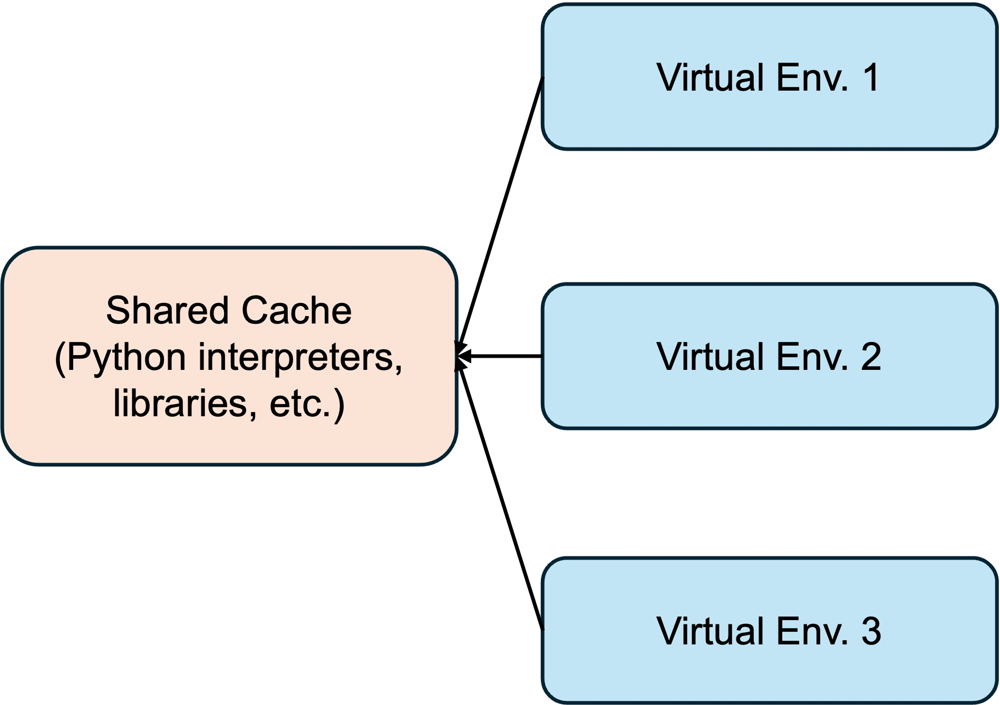
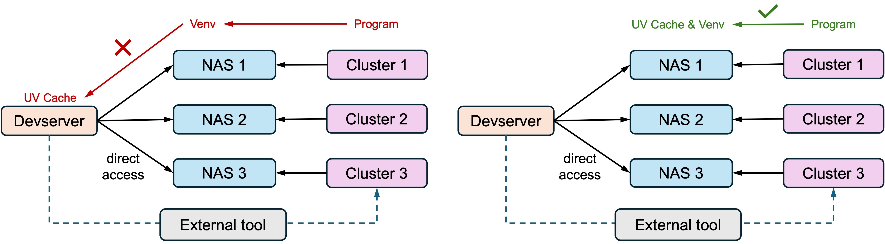

UV Best Practice for Devserver-NAS-Cluster Python Management
============================================================

.. highlight:: bash

Introduction to UV
------------------

UV_ is a lightweight and fast Python manager. Unlike conda, UV uses caching to avoid re-downloading (and re-building) dependencies, usually by linking dependencies in new environments back to a shared cache.

.. _UV: https://docs.astral.sh/uv/

In modern Devserver-NAS-Cluster systems, a common situation is that the user has access to a devserver (jump machine), from which tasks are submitted to cluster nodes for execution via external management tools (e.g., slurm), and the devserver and cluster nodes both have access to shared external NAS. In these systems a common practice is to manage environments on NAS. However, naively using UV would be problemtic in this use.

As shown above, a better practice is to install both the UV cache and virtual environments into each shared NAS. This tutorial highlights a few practices to properly use UV on such systems. 

Installing UV
-------------

On Linux, You can install UV with

.. code-block:: bash

    wget -qO- https://astral.sh/uv/install.sh | sh

or follow the complete guide here: https://docs.astral.sh/uv/getting-started/installation/. The install path of UV itself can be set by ``UV_INSTALL_DIR``. This can be on you devserver.

Installing Python
-----------------

You can install a specific Python version using UV with (but don't do that just yet):

.. code-block:: bash

    uv python install python3.11

This will install a UV-managed python into a default path (for me it's ``/root/.local/share/uv/python``). But remember when we said we need to install Python interpreters on our NAS? Use ``-i`` in this case.

.. code-block:: bash

    uv python install -i /path/to/your_nas/and_then/uv_interpreters python3.11

After that you also need to set ``UV_PYTHON_INSTALL_DIR`` to let UV know you will use Python interpreters installed there.

.. code-block:: bash

    export UV_PYTHON_INSTALL_DIR=/path/to/your_nas/and_then/uv_interpreters
    uv python dir   # just a check, should output /path/to/your_nas/and_then/uv_interpreters

Virtual Environments
--------------------

This is simple. Just do

.. code-block:: bash

    uv venv /path/to/your_nas/and_then/your_env

    source /path/to/your_nas/and_then/your_env/bin/activate # activate
    ... # do stuff with your new venv
    deactivate  # deactivate

.. todo::

    It appears we still have to install Python interpreters, environments and packages on each cluster individually. Check if there is an easier way to clone environments across NAS (UV not using standalone environments is the main problem here). Maybe ``uv sync`` will help?

